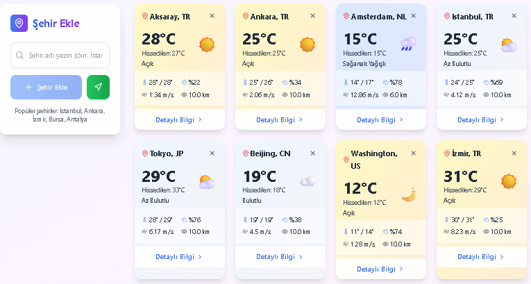

# 🌦️ Hava Durumu Uygulaması



> Next.js ve OpenWeatherMap API kullanarak geliştirilmiş şehir bazlı hava durumu uygulaması.  
> Kullanıcılar şehir listesine kolayca yeni şehir ekleyebilir ve her şehrin detay sayfasında gün bazlı hava durumu bilgilerini görebilir.

---

## 🚀 Canlı Demo  

[](https://hava-durumu-uygulamas-jade.vercel.app/)

---

## 🛠️ Teknolojiler & Araçlar  

[](https://nextjs.org/) 
[](https://tailwindcss.com/) 
[](https://openweathermap.org/) 
[](https://vercel.com/)  

---

## 📸 Ekran Görüntüleri  

| Şehir Listesi | Şehir Detayları |
|---------------|----------------|
|  |  |

> **Not:** Şehir listesi ekranında solda bulunan arama çubugu ile yeni şehir eklenebilir veya doğrudan yeşil butona tıklayarak mevcut konum da listeye eklenebilir.  
> Detay sayfasında gün seçimi yaparak farklı günlerin hava durumuna bakabilirsiniz.

---

## 📦 Kurulum  

Projeyi bilgisayarına klonlayın ve bağımlılıkları yükleyin:  

```bash
git clone https://github.com/yasar68/Hava-Durumu-Uygulamas-.git
npm install
npm start
